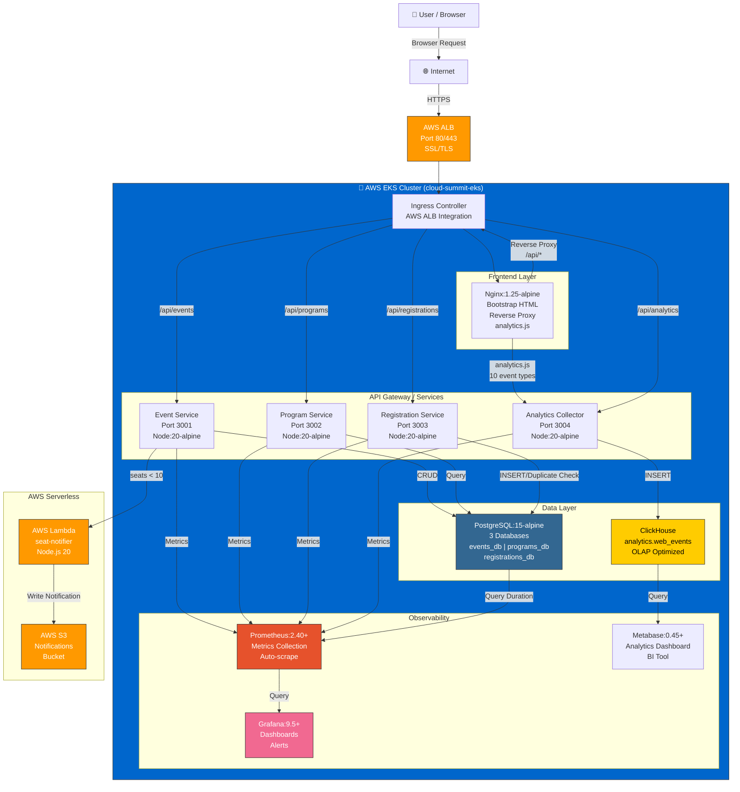
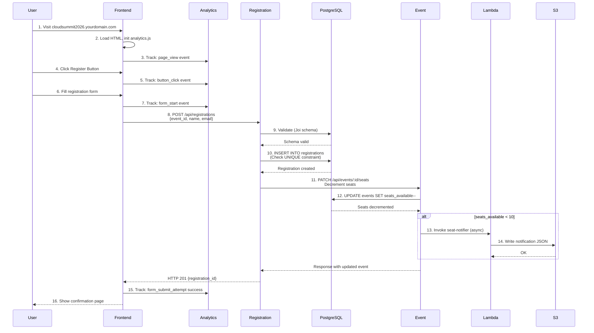
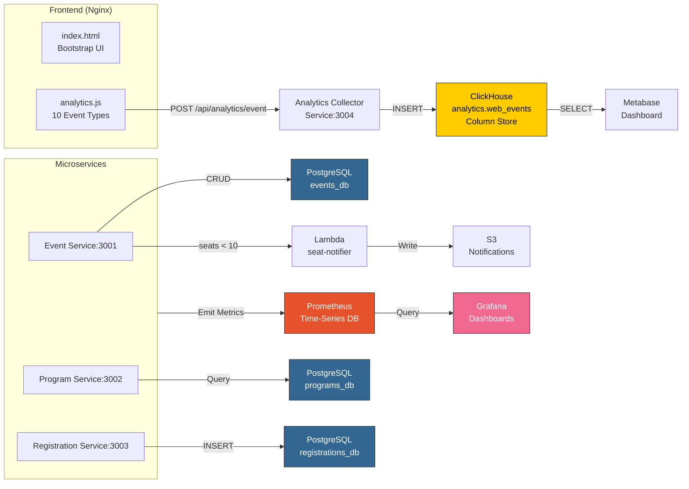

# Solution Architecture Diagram

```mermaid
graph TB
    User["👤 User / Browser"]
    Internet["🌐 Internet"]
    ALB["AWS ALB<br/>Port 80/443<br/>SSL/TLS"]
    
    subgraph EKS ["🎡 AWS EKS Cluster (cloud-summit-eks)"]
        Ingress["Ingress Controller<br/>AWS ALB Integration"]
        
        subgraph Frontend_Layer ["Frontend Layer"]
            FrontendNginx["Nginx:1.25-alpine<br/>Bootstrap HTML<br/>Reverse Proxy<br/>analytics.js"]
        end
        
        subgraph API_Gateway ["API Gateway / Services"]
            EventSvc["Event Service<br/>Port 3001<br/>Node:20-alpine"]
            ProgramSvc["Program Service<br/>Port 3002<br/>Node:20-alpine"]
            RegSvc["Registration Service<br/>Port 3003<br/>Node:20-alpine"]
            AnalyticsSvc["Analytics Collector<br/>Port 3004<br/>Node:20-alpine"]
        end
        
        subgraph Data_Layer ["Data Layer"]
            PostgreSQL["PostgreSQL:15-alpine<br/>3 Databases<br/>events_db | programs_db<br/>registrations_db"]
            ClickHouse["ClickHouse<br/>analytics.web_events<br/>OLAP Optimized"]
        end
        
        subgraph Observability ["Observability"]
            Prometheus["Prometheus:2.40+<br/>Metrics Collection<br/>Auto-scrape"]
            Grafana["Grafana:9.5+<br/>Dashboards<br/>Alerts"]
            Metabase["Metabase:0.45+<br/>Analytics Dashboard<br/>BI Tool"]
        end
    end
    
    subgraph AWS_Serverless ["AWS Serverless"]
        Lambda["AWS Lambda<br/>seat-notifier<br/>Node.js 20"]
        S3["AWS S3<br/>Notifications<br/>Bucket"]
    end
    
    User -->|Browser Request| Internet
    Internet -->|HTTPS| ALB
    ALB --> Ingress
    Ingress --> FrontendNginx
    
    FrontendNginx -->|analytics.js<br/>10 event types| AnalyticsSvc
    FrontendNginx -->|Reverse Proxy<br/>/api/*| Ingress
    
    Ingress -->|/api/events| EventSvc
    Ingress -->|/api/programs| ProgramSvc
    Ingress -->|/api/registrations| RegSvc
    Ingress -->|/api/analytics| AnalyticsSvc
    
    EventSvc -->|CRUD| PostgreSQL
    ProgramSvc -->|Query| PostgreSQL
    RegSvc -->|INSERT/Duplicate Check| PostgreSQL
    
    AnalyticsSvc -->|INSERT| ClickHouse
    
    EventSvc -->|seats < 10| Lambda
    Lambda -->|Write Notification| S3
    
    EventSvc -->|Metrics| Prometheus
    ProgramSvc -->|Metrics| Prometheus
    RegSvc -->|Metrics| Prometheus
    AnalyticsSvc -->|Metrics| Prometheus
    PostgreSQL -->|Query Duration| Prometheus
    
    Prometheus -->|Query| Grafana
    ClickHouse -->|Query| Metabase
    
    style ALB fill:#FF9900,stroke:#333,color:#fff
    style Lambda fill:#FF9900,stroke:#333,color:#fff
    style S3 fill:#FF9900,stroke:#333,color:#fff
    style EKS fill:#0066CC,stroke:#333,color:#fff
    style PostgreSQL fill:#336791,stroke:#333,color:#fff
    style ClickHouse fill:#FFCC00,stroke:#333,color:#000
    style Prometheus fill:#E6522C,stroke:#333,color:#fff
    style Grafana fill:#F16991,stroke:#333,color:#fff
```

---

# Request Flow Diagram

```mermaid
sequenceDiagram
    User->>Frontend: 1. Visit cloudsummit2026.yourdomain.com
    Frontend->>Frontend: 2. Load HTML, init analytics.js
    Frontend->>Analytics: 3. Track: page_view event
    User->>Frontend: 4. Click Register Button
    Frontend->>Analytics: 5. Track: button_click event
    User->>Frontend: 6. Fill registration form
    Frontend->>Analytics: 7. Track: form_start event
    Frontend->>Registration: 8. POST /api/registrations<br/>{event_id, name, email}
    Registration->>PostgreSQL: 9. Validate (Joi schema)
    PostgreSQL-->>Registration: Schema valid
    Registration->>PostgreSQL: 10. INSERT INTO registrations<br/>(Check UNIQUE constraint)
    PostgreSQL-->>Registration: Registration created
    Registration->>Event: 11. PATCH /api/events/:id/seats<br/>Decrement seats
    Event->>PostgreSQL: 12. UPDATE events SET seats_available--
    PostgreSQL-->>Event: Seats decremented
    
    alt seats_available < 10
        Event->>Lambda: 13. Invoke seat-notifier (async)
        Lambda->>S3: 14. Write notification JSON
        S3-->>Lambda: OK
    end
    
    Event-->>Registration: Response with updated event
    Registration-->>Frontend: HTTP 201 {registration_id}
    Frontend->>Analytics: 15. Track: form_submit_attempt success
    Frontend-->>User: 16. Show confirmation page
```

---

# Data Flow Diagram

```mermaid
graph LR
    subgraph Frontend ["Frontend (Nginx)"]
        HTML["index.html<br/>Bootstrap UI"]
        JS["analytics.js<br/>10 Event Types"]
    end
    
    JS -->|POST /api/analytics/event| AnalyticsCollector["Analytics Collector<br/>Service:3004"]
    
    AnalyticsCollector -->|INSERT| ClickHouse["ClickHouse<br/>analytics.web_events<br/>Column Store"]
    
    ClickHouse -->|SELECT| Metabase["Metabase<br/>Dashboard"]
    
    subgraph Services ["Microservices"]
        Event["Event Service:3001"]
        Program["Program Service:3002"]
        Registration["Registration Service:3003"]
    end
    
    Event -->|CRUD| EventDB["PostgreSQL<br/>events_db"]
    Program -->|Query| ProgramDB["PostgreSQL<br/>programs_db"]
    Registration -->|INSERT| RegDB["PostgreSQL<br/>registrations_db"]
    
    Event -->|seats < 10| Lambda["Lambda<br/>seat-notifier"]
    Lambda -->|Write| S3["S3<br/>Notifications"]
    
    Services -->|Emit Metrics| Prometheus["Prometheus<br/>Time-Series DB"]
    Prometheus -->|Query| Grafana["Grafana<br/>Dashboards"]
    
    style ClickHouse fill:#FFCC00,stroke:#333,color:#000
    style EventDB fill:#336791,stroke:#333,color:#fff
    style ProgramDB fill:#336791,stroke:#333,color:#fff
    style RegDB fill:#336791,stroke:#333,color:#fff
    style Prometheus fill:#E6522C,stroke:#333,color:#fff
    style Grafana fill:#F16991,stroke:#333,color:#fff
```
