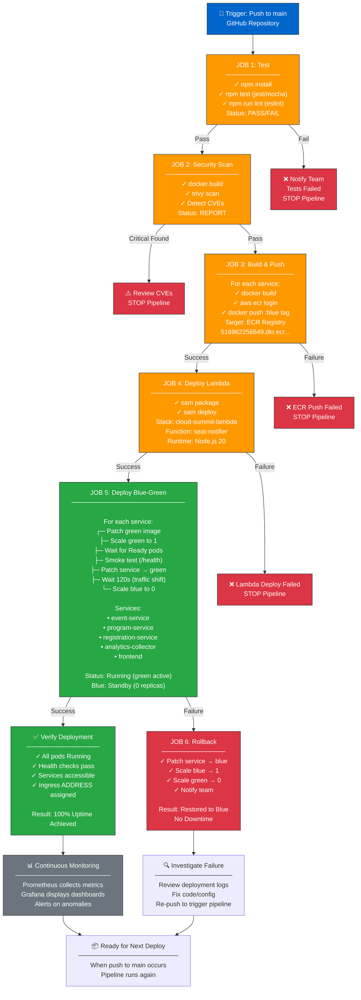
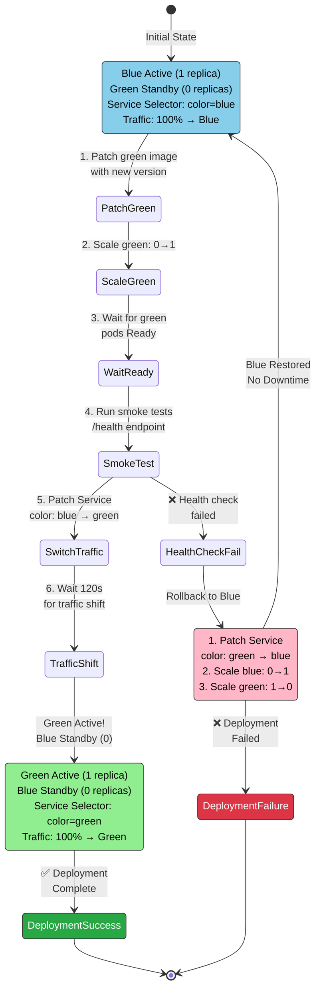
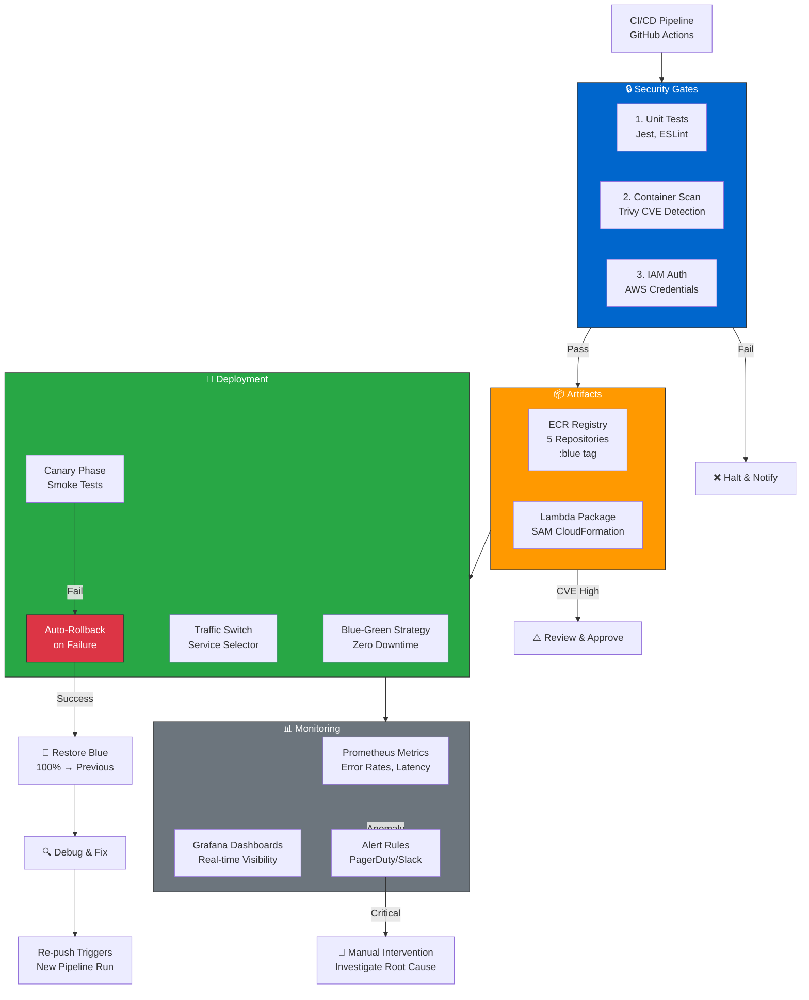
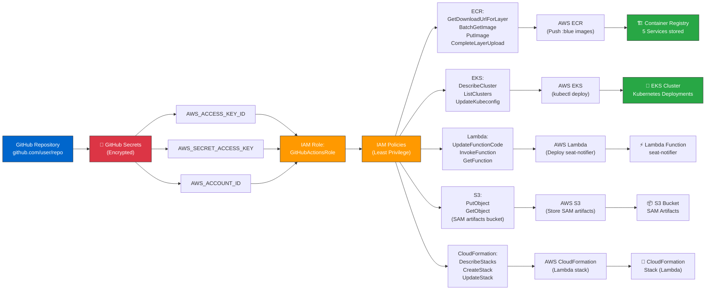

# CI/CD Pipeline Architecture Diagram

```mermaid
graph TD
    Trigger["📌 Trigger: Push to main<br/>GitHub Repository"]
    
    Trigger --> Test["JOB 1: Test<br/>────────────<br/>✓ npm install<br/>✓ npm test (jest/mocha)<br/>✓ npm run lint (eslint)<br/>Status: PASS/FAIL"]
    
    Test -->|Pass| Security["JOB 2: Security Scan<br/>────────────────<br/>✓ docker build<br/>✓ trivy scan<br/>✓ Detect CVEs<br/>Status: REPORT"]
    
    Test -->|Fail| Notify1["❌ Notify Team<br/>Tests Failed<br/>STOP Pipeline"]
    
    Security -->|Critical Found| Notify2["⚠️ Review CVEs<br/>STOP Pipeline"]
    
    Security -->|Pass| Build["JOB 3: Build & Push<br/>─────────────────<br/>For each service:<br/>✓ docker build<br/>✓ aws ecr login<br/>✓ docker push :blue tag<br/>Target: ECR Registry<br/>516962256649.dkr.ecr..."]
    
    Build -->|Success| Lambda["JOB 4: Deploy Lambda<br/>────────────────────<br/>✓ sam package<br/>✓ sam deploy<br/>Stack: cloud-summit-lambda<br/>Function: seat-notifier<br/>Runtime: Node.js 20"]
    
    Build -->|Failure| Notify3["❌ ECR Push Failed<br/>STOP Pipeline"]
    
    Lambda -->|Success| Deploy["JOB 5: Deploy Blue-Green<br/>─────────────────────────<br/><br/>For each service:<br/>┌─ Patch green image<br/>├─ Scale green to 1<br/>├─ Wait for Ready pods<br/>├─ Smoke test (/health)<br/>├─ Patch service → green<br/>├─ Wait 120s (traffic shift)<br/>└─ Scale blue to 0<br/><br/>Services:<br/>• event-service<br/>• program-service<br/>• registration-service<br/>• analytics-collector<br/>• frontend<br/><br/>Status: Running (green active)<br/>Blue: Standby (0 replicas)"]
    
    Lambda -->|Failure| Notify4["❌ Lambda Deploy Failed<br/>STOP Pipeline"]
    
    Deploy -->|Success| Verify["✅ Verify Deployment<br/>────────────────<br/>✓ All pods Running<br/>✓ Health checks pass<br/>✓ Services accessible<br/>✓ Ingress ADDRESS assigned<br/><br/>Result: 100% Uptime Achieved"]
    
    Deploy -->|Failure| Rollback["JOB 6: Rollback<br/>──────────────<br/>✓ Patch service → blue<br/>✓ Scale blue → 1<br/>✓ Scale green → 0<br/>✓ Notify team<br/><br/>Result: Restored to Blue<br/>No Downtime"]
    
    Verify --> Monitor["📊 Continuous Monitoring<br/>─────────────────────<br/>Prometheus collects metrics<br/>Grafana displays dashboards<br/>Alerts on anomalies"]
    
    Rollback --> Investigate["🔍 Investigate Failure<br/>─────────────────<br/>Review deployment logs<br/>Fix code/config<br/>Re-push to trigger pipeline"]
    
    Monitor --> NextDeploy["📦 Ready for Next Deploy<br/>──────────────────────<br/>When push to main occurs<br/>Pipeline runs again"]
    
    Investigate --> NextDeploy
    
    style Trigger fill:#0066CC,stroke:#333,color:#fff
    style Test fill:#FF9900,stroke:#333,color:#fff
    style Security fill:#FF9900,stroke:#333,color:#fff
    style Build fill:#FF9900,stroke:#333,color:#fff
    style Lambda fill:#FF9900,stroke:#333,color:#fff
    style Deploy fill:#28A745,stroke:#333,color:#fff
    style Verify fill:#28A745,stroke:#333,color:#fff
    style Rollback fill:#DC3545,stroke:#333,color:#fff
    style Monitor fill:#6C757D,stroke:#333,color:#fff
    style Notify1 fill:#DC3545,stroke:#333,color:#fff
    style Notify2 fill:#DC3545,stroke:#333,color:#fff
    style Notify3 fill:#DC3545,stroke:#333,color:#fff
    style Notify4 fill:#DC3545,stroke:#333,color:#fff
```

---

# Blue-Green Deployment State Machine

```mermaid
stateDiagram-v2
    [*] --> BlueActive: Initial State

    BlueActive: Blue Active (1 replica)<br/>Green Standby (0 replicas)<br/>Service Selector: color=blue<br/>Traffic: 100% → Blue

    BlueActive --> PatchGreen: 1. Patch green image<br/>with new version
    
    PatchGreen --> ScaleGreen: 2. Scale green: 0→1
    
    ScaleGreen --> WaitReady: 3. Wait for green<br/>pods Ready
    
    WaitReady --> SmokeTest: 4. Run smoke tests<br/>/health endpoint
    
    SmokeTest --> SwitchTraffic: 5. Patch Service<br/>color: blue → green
    
    SwitchTraffic --> TrafficShift: 6. Wait 120s<br/>for traffic shift
    
    TrafficShift --> GreenActive: Green Active!<br/>Blue Standby (0)
    
    GreenActive: Green Active (1 replica)<br/>Blue Standby (0 replicas)<br/>Service Selector: color=green<br/>Traffic: 100% → Green

    GreenActive --> DeploymentSuccess: ✅ Deployment<br/>Complete

    DeploymentSuccess --> [*]

    SmokeTest --> HealthCheckFail: ❌ Health check<br/>failed
    
    HealthCheckFail --> Rollback: Rollback to Blue
    
    Rollback: 1. Patch Service<br/>color: green → blue<br/>2. Scale blue: 0→1<br/>3. Scale green: 1→0

    Rollback --> BlueActive: Blue Restored<br/>No Downtime

    Rollback --> DeploymentFailure: ❌ Deployment<br/>Failed

    DeploymentFailure --> [*]

    style BlueActive fill:#87CEEB,stroke:#333,color:#000
    style GreenActive fill:#90EE90,stroke:#333,color:#000
    style Rollback fill:#FFB6C6,stroke:#333,color:#000
    style DeploymentSuccess fill:#28A745,stroke:#333,color:#fff
    style DeploymentFailure fill:#DC3545,stroke:#333,color:#fff
```

---

# CI/CD Security & Failure Recovery

```mermaid
graph TB
    Pipeline["CI/CD Pipeline<br/>GitHub Actions"]
    
    subgraph Security ["🔒 Security Gates"]
        Test["1. Unit Tests<br/>Jest, ESLint"]
        Scan["2. Container Scan<br/>Trivy CVE Detection"]
        Auth["3. IAM Auth<br/>AWS Credentials"]
    end
    
    subgraph Artifacts ["📦 Artifacts"]
        ECR["ECR Registry<br/>5 Repositories<br/>:blue tag"]
        Lambda["Lambda Package<br/>SAM CloudFormation"]
    end
    
    subgraph Deployment ["🚀 Deployment"]
        BlueGreen["Blue-Green Strategy<br/>Zero Downtime"]
        Canary["Canary Phase<br/>Smoke Tests"]
        Traffic["Traffic Switch<br/>Service Selector"]
        Rollback["Auto-Rollback<br/>on Failure"]
    end
    
    subgraph Monitoring ["📊 Monitoring"]
        Prometheus["Prometheus Metrics<br/>Error Rates, Latency"]
        Grafana["Grafana Dashboards<br/>Real-time Visibility"]
        Alerts["Alert Rules<br/>PagerDuty/Slack"]
    end
    
    Pipeline --> Security
    Security -->|Pass| Artifacts
    Security -->|Fail| Notify1["❌ Halt & Notify"]
    
    Artifacts --> Deployment
    Artifacts -->|CVE High| Notify2["⚠️ Review & Approve"]
    
    Deployment --> Monitoring
    
    Canary -->|Fail| Rollback
    Rollback -->|Success| Restore["🔄 Restore Blue<br/>100% → Previous"]
    
    Monitoring -->|Anomaly| Alerts
    Alerts -->|Critical| Manual["👤 Manual Intervention<br/>Investigate Root Cause"]
    
    Restore --> Investigate["🔍 Debug & Fix"]
    Investigate --> Redeploy["Re-push Triggers<br/>New Pipeline Run"]
    
    style Security fill:#0066CC,stroke:#333,color:#fff
    style Artifacts fill:#FF9900,stroke:#333,color:#fff
    style Deployment fill:#28A745,stroke:#333,color:#fff
    style Monitoring fill:#6C757D,stroke:#333,color:#fff
    style Rollback fill:#DC3545,stroke:#333,color:#fff
```

---

# GitHub Actions Secrets & RBAC

```mermaid
graph LR
    GitHub["GitHub Repository<br/>github.com/user/repo"]
    
    GitHub --> Secrets["🔐 GitHub Secrets<br/>(Encrypted)"]
    
    Secrets --> AWS_KEY["AWS_ACCESS_KEY_ID"]
    Secrets --> AWS_SECRET["AWS_SECRET_ACCESS_KEY"]
    Secrets --> ACCOUNT["AWS_ACCOUNT_ID"]
    
    AWS_KEY --> IAMRole["IAM Role:<br/>GitHubActionsRole"]
    AWS_SECRET --> IAMRole
    ACCOUNT --> IAMRole
    
    IAMRole --> Policies["IAM Policies<br/>(Least Privilege)"]
    
    Policies --> ECR_Policy["ECR:<br/>GetDownloadUrlForLayer<br/>BatchGetImage<br/>PutImage<br/>CompleteLayerUpload"]
    
    Policies --> EKS_Policy["EKS:<br/>DescribeCluster<br/>ListClusters<br/>UpdateKubeconfig"]
    
    Policies --> Lambda_Policy["Lambda:<br/>UpdateFunctionCode<br/>InvokeFunction<br/>GetFunction"]
    
    Policies --> S3_Policy["S3:<br/>PutObject<br/>GetObject<br/>(SAM artifacts bucket)"]
    
    Policies --> CloudFormation["CloudFormation:<br/>DescribeStacks<br/>CreateStack<br/>UpdateStack"]
    
    ECR_Policy --> ECR_Service["AWS ECR<br/>(Push :blue images)"]
    EKS_Policy --> EKS_Service["AWS EKS<br/>(kubectl deploy)"]
    Lambda_Policy --> Lambda_Service["AWS Lambda<br/>(Deploy seat-notifier)"]
    S3_Policy --> S3_Service["AWS S3<br/>(Store SAM artifacts)"]
    CloudFormation --> CF_Service["AWS CloudFormation<br/>(Lambda stack)"]
    
    ECR_Service --> Registry["🏗️ Container Registry<br/>5 Services stored"]
    EKS_Service --> Cluster["🎡 EKS Cluster<br/>Kubernetes Deployments"]
    Lambda_Service --> Lambda_Func["⚡ Lambda Function<br/>seat-notifier"]
    S3_Service --> Bucket["📦 S3 Bucket<br/>SAM Artifacts"]
    CF_Service --> Stack["📄 CloudFormation<br/>Stack (Lambda)"]
    
    style GitHub fill:#0066CC,stroke:#333,color:#fff
    style Secrets fill:#DC3545,stroke:#333,color:#fff
    style IAMRole fill:#FF9900,stroke:#333,color:#fff
    style Policies fill:#FF9900,stroke:#333,color:#fff
    style Registry fill:#28A745,stroke:#333,color:#fff
    style Cluster fill:#28A745,stroke:#333,color:#fff
```
